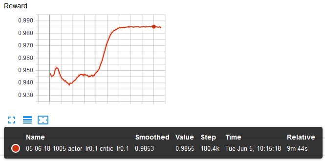

# CommNet-BiCnet
CommNet and BiCnet implementation in tensorflow

## Training
Train CommNet using DDPG algorithm
```
python train_comm_net.py
```

## Hypersearch
To find the optimal hyperparameters such as `actor_lr` or `critic_lr`, a simple grid search has been implemented. It launches multiple instances of the trainer in parallel based on the number of CPU cores.
```
python hypersearch.py
```

## Guessing sum environment
It is a simple game described in the [BiCnet](https://arxiv.org/abs/1703.10069) paper for testing if the communication works. The environment implements the crucial methods of the core gym interface from OpenAI

Each agent receives a scalar sampled between `[−10, 10]` under a truncated Gaussian. Each agent needs to output the sum of all inputs received among the agents. An agent gets a normalized reward between `[0, 1]` based on the absolute difference between the sum and its output.

## Results
### Training CommNet in the Guessing sum env with 2 agents

